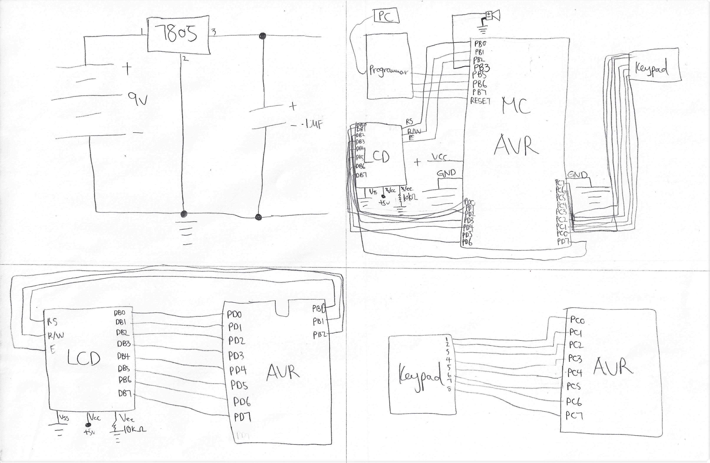
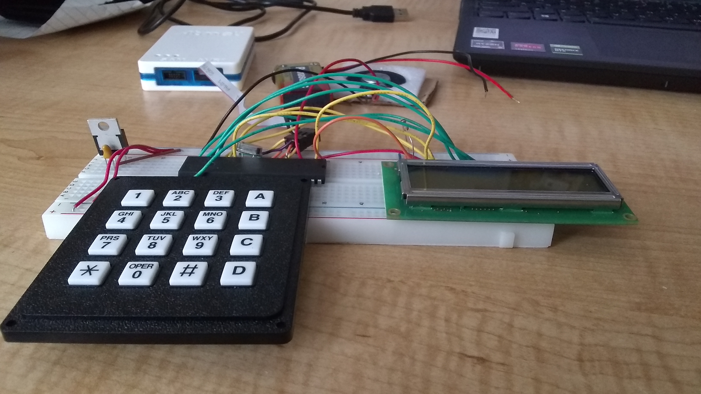
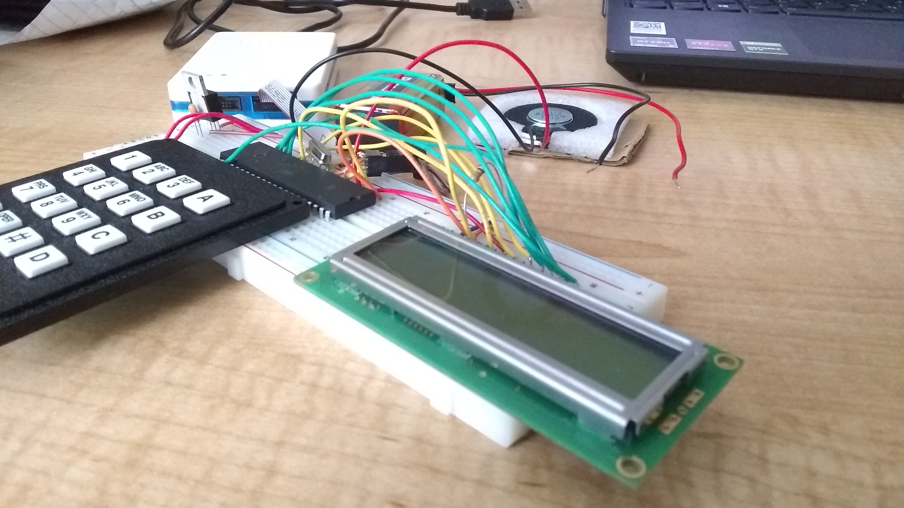
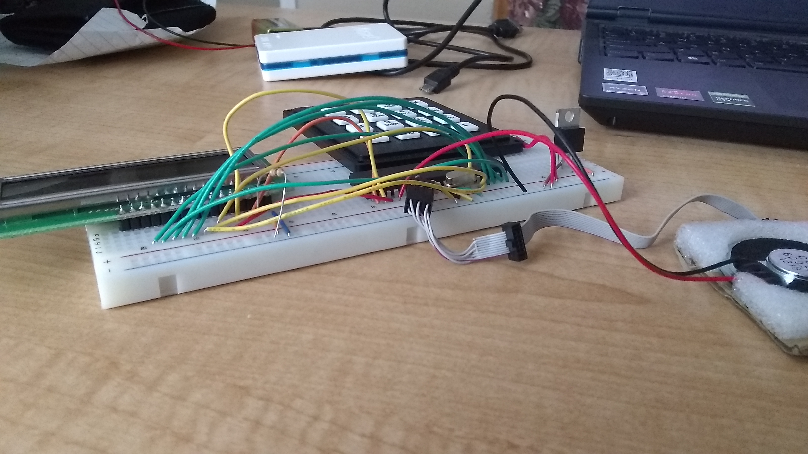
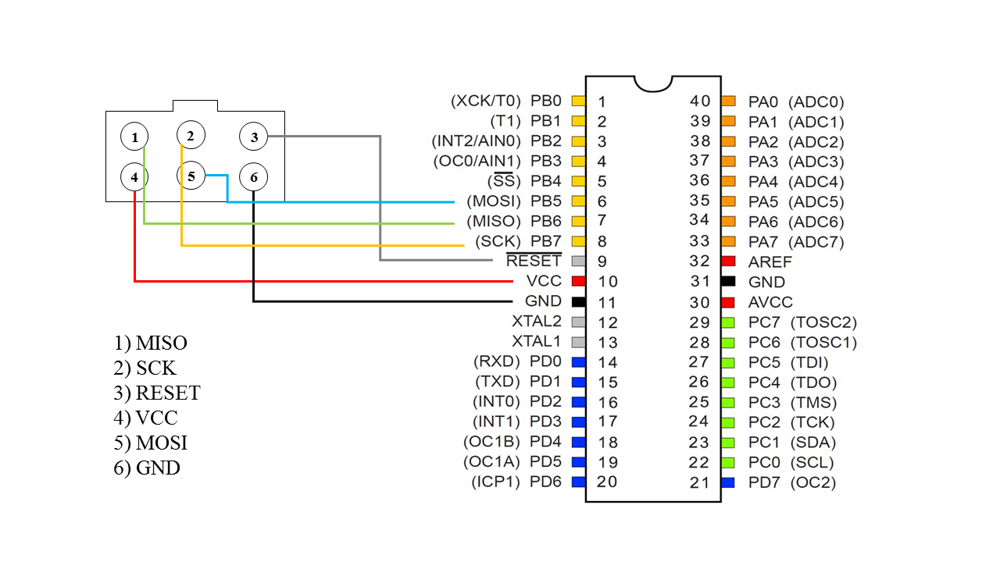

# CGuard
A combination lock written in C which allows users to create single-use passwords in a session. A video of the application can be found [here](https://youtu.be/XeMv6YNShyc).

## Running the Application
CGuard is written with Microchip Studio. It is highly recommended to run and develop this application under Windows due to minimal problems. A detailed list of the components used can be found [here](material.pdf).

### Steps
1. Assemble the physical components according to the schema and images of physical circuits below.
   + Remember to connect the breadboard like the connector diagram specified.
2. Open Microchip Studio.
3. Press "New Project" in the welcome page.
4. Select "AVR XC8 C Application Project" and press "OK."
5. Specify the device as "ATMEGA32."
6. Import the files by right click on the solution explorer, select "Add->Existing Item," and add the files.
7. When you run the program first time, choose the debugger/programmer as the second item on the dropdown menu.
8. Click the green triangle button ("Run") on the top

#### Schema & Circuit

 

 

 

#### Connector

## Acknowledgments
This project is originally developed for UC Irvine's CS 145/CSE 145 taught by Prof. Tony Givargis. During the development process, some assistance is received from the TAs for software library usage.
